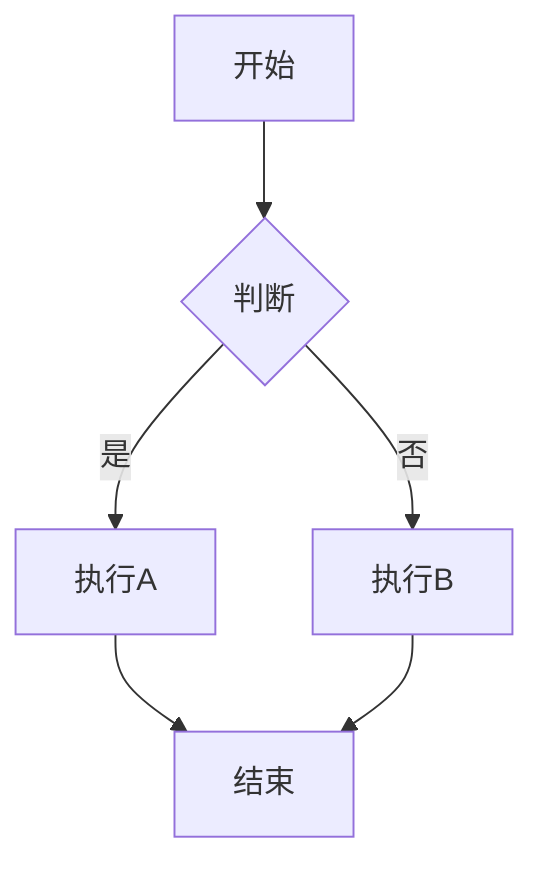

本文档将全面介绍博客系统的使用方法、支持的Markdown语法，以及最佳实践。

## 📋 目录

- [系统介绍](#系统介绍)
- [基础语法](#基础语法)
- [高级语法](#高级语法)
- [代码展示](#代码展示)
- [实战示例](#实战示例)
- [最佳实践](#最佳实践)

## 系统介绍

这是一个**完全自动化的博客系统**，基于React + Vite + Markdown构建。

### 核心特性

- ✅ **零配置** - 添加文件即可自动识别
- ✅ **智能化** - 自动提取元数据
- ✅ **美观化** - 终端主题风格
- ✅ **功能全** - 完整Markdown支持

### 快速开始

只需在 `src/content/blogs/` 目录下创建 `.md` 文件即可！

```bash
# 创建新博客
touch src/content/blogs/我的博客.md

# 编写内容
vim src/content/blogs/我的博客.md

# 自动识别，无需配置！
```

---

## 基础语法

### 标题

支持6级标题，从大到小：

```markdown
# 一级标题（最大）
## 二级标题
### 三级标题
#### 四级标题
##### 五级标题
###### 六级标题（最小）
```

**推荐使用**：
- `#` 用于文章主标题
- `##` 用于章节标题
- `###` 用于小节标题

### 段落和换行

```markdown
这是第一个段落。可以包含多个句子。

这是第二个段落。

这是同一段落的换行。  
在行末添加两个空格可以实现硬换行。
```

### 强调

```markdown
**粗体文本**
*斜体文本*
***粗斜体文本***
~~删除线文本~~
```

**显示效果**：
- **粗体文本**
- *斜体文本*
- ***粗斜体文本***
- ~~删除线文本~~

### 引用

```markdown
> 这是一个引用块
> 可以包含多行内容

> 这是第一层引用
>> 这是第二层引用
>>> 这是第三层引用
```

**显示效果**：

> 这是一个引用块
> 可以包含多行内容

---

## 高级语法

### 代码

#### 行内代码

使用单个反引号包裹：

```markdown
使用 `console.log()` 打印内容
```

显示：使用 `console.log()` 打印内容

#### 代码块

使用三个反引号包裹：

````markdown
```javascript
function hello(name) {
  console.log(`Hello, ${name}!`);
}

hello('World');
```
````

**支持的语言**：
- `javascript` / `js`
- `typescript` / `ts`
- `python`
- `java`
- `cpp` / `c++`
- `css`
- `html`
- `json`
- `bash` / `shell`
- 等等...

### 列表

#### 无序列表

```markdown
- 第一项
- 第二项
  - 嵌套项
  - 嵌套项
- 第三项

* 也可以使用星号
+ 或者加号
```

**显示效果**：
- 第一项
- 第二项
  - 嵌套项
  - 嵌套项
- 第三项

#### 有序列表

```markdown
1. 第一步
2. 第二步
3. 第三步

1. 第一项
1. 第二项（会自动编号）
1. 第三项
```

**显示效果**：
1. 第一步
2. 第二步
3. 第三步

### 链接

```markdown
[链接文本](https://example.com)
[带标题的链接](https://example.com "标题")
[引用式链接][reference]

[reference]: https://example.com
```

### 图片

```markdown


```

### 表格

```markdown
| 列1 | 列2 | 列3 |
|-----|-----|-----|
| 数据1 | 数据2 | 数据3 |
| 左对齐 | 居中 | 右对齐 |

:--- 左对齐
:---: 居中
---: 右对齐
```

**完整示例**：

| 功能 | 语法 | 状态 |
|------|------|:----:|
| 标题 | `# 标题` | ✅ |
| 粗体 | `**文本**` | ✅ |
| 代码 | `` `代码` `` | ✅ |
| 链接 | `[文本](url)` | ✅ |
| 表格 | `| 列 |` | ✅ |

### 水平线

```markdown
---
***
___
```

---

## 代码展示

### JavaScript示例

```javascript
// 计算斐波那契数列
function fibonacci(n) {
  if (n <= 1) return n;
  return fibonacci(n - 1) + fibonacci(n - 2);
}

// 使用动态规划优化
function fibonacciDP(n) {
  const dp = [0, 1];
  for (let i = 2; i <= n; i++) {
    dp[i] = dp[i - 1] + dp[i - 2];
  }
  return dp[n];
}

console.log(fibonacciDP(10)); // 55
```

### Python示例

```python
# Python装饰器示例
def log_decorator(func):
    def wrapper(*args, **kwargs):
        print(f'调用函数: {func.__name__}')
        result = func(*args, **kwargs)
        print(f'返回值: {result}')
        return result
    return wrapper

@log_decorator
def add(a, b):
    return a + b

print(add(1, 2))  # 输出调用过程和结果
```

### TypeScript示例

```typescript
// 泛型接口示例
interface Repository<T> {
  findById(id: string): Promise<T | null>;
  save(entity: T): Promise<T>;
  delete(id: string): Promise<void>;
}

// 使用泛型
class UserRepository implements Repository<User> {
  async findById(id: string): Promise<User | null> {
    // 实现逻辑
    return null;
  }
  
  async save(user: User): Promise<User> {
    // 实现逻辑
    return user;
  }
  
  async delete(id: string): Promise<void> {
    // 实现逻辑
  }
}
```

### CSS示例

```css
/* 终端主题样式 */
.terminal {
  background: linear-gradient(135deg, #0a0a0a 0%, #1a1a2e 50%, #0a0a0a 100%);
  color: #00ff00;
  font-family: 'Courier New', Courier, monospace;
}

.command-input input {
  background-color: transparent;
  border: none;
  color: #00ff00;
  text-shadow: 0 0 8px rgba(0, 255, 0, 0.5);
  caret-color: #00ff00;
}
```

### JSON示例

```json
{
  "name": "Terminal Portfolio",
  "version": "1.0.0",
  "features": [
    "粒子背景动画",
    "MDX博客系统",
    "命令历史导航",
    "交互式帮助"
  ],
  "commands": {
    "help": "显示帮助信息",
    "blogs": "查看博客列表",
    "clear": "清空屏幕"
  }
}
```

### Bash示例

```bash
#!/bin/bash

# 创建博客文件
create_blog() {
  local title=$1
  local filename="${title}.md"
  
  cat > "src/content/blogs/${filename}" << EOF
---
title: ${title}
date: $(date +%Y-%m-%d)
icon: 📝
---

# ${title}

文章内容...

EOF

  echo "✅ 已创建: ${filename}"
}

# 使用示例
create_blog "我的新文章"
```

---

## 实战示例

### React组件示例

```javascript
import { useState, useEffect } from 'react';

function BlogList() {
  const [blogs, setBlogs] = useState([]);
  
  useEffect(() => {
    // 动态加载博客
    const modules = import.meta.glob('../content/blogs/*.md', { 
      eager: true,
      query: '?raw'
    });
    
    const blogList = Object.entries(modules).map(([path, content], idx) => {
      return {
        id: idx + 1,
        title: extractTitle(content),
        content
      };
    });
    
    setBlogs(blogList);
  }, []);
  
  return (
    <div>
      {blogs.map(blog => (
        <div key={blog.id}>
          <h2>{blog.title}</h2>
          <BlogRenderer content={blog.content} />
        </div>
      ))}
    </div>
  );
}
```

### Git命令示例

```bash
# 提交博客文章
git add src/content/blogs/
git commit -m "docs: 添加新的博客文章"
git push origin main

# 查看博客历史
git log --oneline src/content/blogs/

# 统计博客字数
find src/content/blogs -name "*.md" -exec wc -w {} +
```

---

## 最佳实践

### 1. 文件命名

**推荐**：
```bash
React组件最佳实践.md
TypeScript从入门到精通.md
前端性能优化指南.md
```

**不推荐**：
```bash
blog-1.md           # 无意义
Untitled.md         # 默认名称
article 1.md        # 包含空格
```

### 2. 文章结构

**标准结构**：

```markdown
---
title: 文章标题
date: 2024-12-31
icon: 📝
---

# 文章标题

> 简短描述

## 📋 目录

- [章节1](#章节1)
- [章节2](#章节2)

## 章节1

详细内容...

## 章节2

详细内容...

## 总结

总结内容...
```

### 3. 代码规范

- **添加语言标识** - 让语法高亮生效
- **添加注释** - 解释复杂逻辑
- **保持简洁** - 只展示关键代码

```javascript
// ✅ 好的示例
function calculateSum(arr) {
  return arr.reduce((sum, num) => sum + num, 0);
}

// ❌ 不好的示例
function calc(a){
let r=0;for(let i of a)r+=i;return r;
}
```

### 4. 引用和参考

```markdown
> **提示**: 重要信息使用引用块强调

> **警告**: 可能的错误或陷阱

> **注意**: 需要注意的事项
```

### 5. 表格使用

- 用于对比数据
- 列出功能特性
- 展示配置选项

```markdown
| 命令 | 功能 | 快捷键 |
|------|------|--------|
| help | 帮助 | - |
| clear | 清屏 | Ctrl+L |
| blogs | 博客 | - |
```

---

## 常见问题

### Q1: 如何添加新博客？

A: 只需在 `src/content/blogs/` 目录下创建 `.md` 文件即可。系统会自动识别！

### Q2: 支持哪些Markdown语法？

A: 支持标准Markdown和GitHub扩展语法，包括：
- 标题、段落、列表
- 代码块（语法高亮）
- 表格、链接、图片
- 引用块、水平线

### Q3: 如何自定义博客元数据？

A: 在文章开头添加YAML frontmatter：

```markdown
---
title: 自定义标题
date: 2024-12-31
icon: 🎨
desc: 自定义描述
---
```

### Q4: 代码高亮支持哪些语言？

A: 支持几乎所有主流编程语言的语法高亮：
- JavaScript, TypeScript
- Python, Java
- CSS, HTML
- JSON, YAML
- Bash, Shell
- 等等...

### Q5: 博客会自动排序吗？

A: 目前按文件系统顺序显示。未来可扩展为按日期排序。

---

## 技巧和窍门

### 技巧1: 使用emoji增强可读性

```markdown
✅ 已完成
❌ 错误示例
⚠️ 警告
💡 提示
🔥 重要
🎯 目标
```

### 技巧2: 使用代码折叠展示

对于长代码块，使用语法高亮可以保持代码整洁：

```javascript
// 这是折叠的代码块
function complexFunction() {
  // 复杂逻辑...
  return result;
}
```

### 技巧3: 混合使用语法

```markdown
在 `代码中` 使用**粗体**来强调关键部分。

这是普通段落，包含 `代码片段` 和 [链接](url)。
```

### 技巧4: 使用表格对比

| 方式 | 优点 | 缺点 |
|------|------|------|
| Frontmatter | 灵活、可控 | 需要学习 |
| 标准Markdown | 简单、通用 | 功能有限 |

---

## 示例：完整文章模板

```markdown
---
title: 我的技术分享
date: 2024-12-31
icon: 📚
desc: 关于某个技术主题的深度解析
---

# 我的技术分享

> 关于某个技术主题的深度解析

## 📋 目录

- [引言](#引言)
- [正文内容](#正文内容)
- [代码示例](#代码示例)
- [总结](#总结)

## 引言

这是文章的引言部分...

## 正文内容

### 核心概念

详细讲解...

**关键点**：
- 要点1
- 要点2
- 要点3

### 实际应用

1. 第一步：准备
2. 第二步：实施
3. 第三步：验证

## 代码示例

```javascript
// 完整可运行的代码示例
function example() {
  return 'Hello, World!';
}
```

## 总结

在这篇文章中，我们学习了：

- ✅ 概念理解
- ✅ 实践应用
- ✅ 最佳实践

**下一步**：尝试自己实现！

---

**参考资料**：
- [React官方文档](https://react.dev)
- [MDN Web Docs](https://developer.mozilla.org)
```

---

## 高级用法

### 使用HTML（部分支持）

```html
<div style="color: red;">
  这是 <strong>HTML</strong> 内容
</div>
```

### 使用数学公式（未来支持）

```latex
$$E = mc^2$$

行内公式：$x = \frac{-b \pm \sqrt{b^2 - 4ac}}{2a}$
```

### 使用Mermaid图表（未来支持）



---

## 调试技巧

### 查看博客列表

```bash
# 在终端输入
blogs

# 应该看到所有自动识别的博客
```

### 测试渲染

```bash
# 输入命令测试
read 1
read 2
read 3
```

### 检查元数据提取

查看终端中显示的标题、描述是否符合预期。

---

## 总结

### 核心优势

✅ **零配置** - 添加文件即可
✅ **智能化** - 自动提取元数据
✅ **功能全** - 完整Markdown支持
✅ **美观化** - 终端主题风格
✅ **易扩展** - 组件化架构

### 推荐流程

1. 📝 **创建文件** - 在blogs目录创建.md文件
2. ✍️ **编写内容** - 使用标准Markdown
3. 🎨 **可选配置** - 添加frontmatter
4. ✅ **自动识别** - 系统自动扫描
5. 🚀 **立即使用** - blogs命令查看

### 下一步

- 添加更多技术博客
- 分享你的经验
- 学习Markdown语法
- 探索更多功能

---

**快速开始**：

```bash
# 1. 创建博客
touch src/content/blogs/我的第一篇博客.md

# 2. 编写内容
# 使用本文展示的所有语法

# 3. 查看效果
npm start → blogs → read 1
```

现在就开始写你的第一篇博客吧！📝✨

